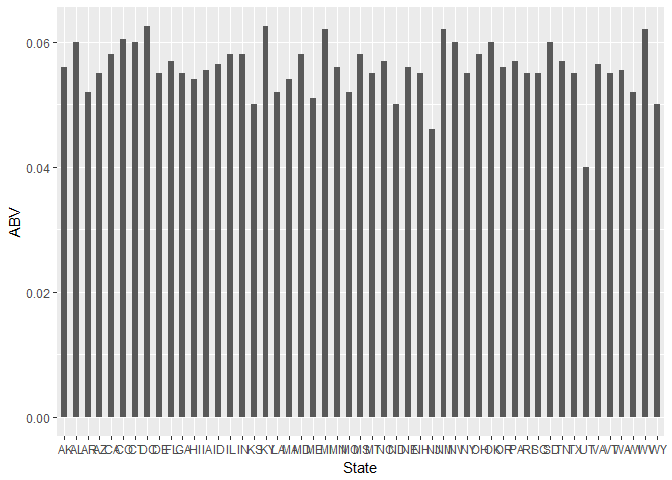
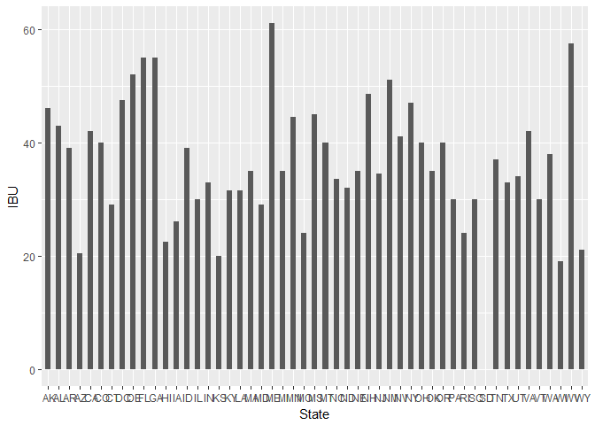

# US Beers and Breweries Analysis
Alvarado, Cynthia  
July 1, 2017  


## Setup by Import and housekeeping

The two data sets are available in the Data folder as CSV files.  Foremost, an import of the Beers and Brewerey data will load into R for analysis.  After the import, the str() function will give information on the columns and will serve to check that the data was loaded correctly.
<br>

The non-numeric columns were brought in as <i>factors</i>.  Using the as.character() function, the columns are converted to character type, to make it easier to store as a string vector for graph labels.


```r
#install libraries used
library(ggplot2)
library(plyr)


#create variables for the url for the data we are utlilizing
brewery.url <- 'https://raw.githubusercontent.com/alvaradoc/US_Beers-Brew/master/Data/Breweries.csv'
beer.url <- 'https://raw.githubusercontent.com/alvaradoc/US_Beers-Brew/master/Data/Beers.csv'

#import the data into R
breweries <- read.csv(brewery.url, header = TRUE)
beers <- read.csv(beer.url, header = TRUE)

#check the type of data and ensure successful import
str(breweries)
```

```
## 'data.frame':	558 obs. of  4 variables:
##  $ Brew_ID: int  1 2 3 4 5 6 7 8 9 10 ...
##  $ Name   : Factor w/ 551 levels "10 Barrel Brewing Company",..: 355 12 266 319 201 136 227 477 59 491 ...
##  $ City   : Factor w/ 384 levels "Abingdon","Abita Springs",..: 228 200 122 299 300 62 91 48 152 136 ...
##  $ State  : Factor w/ 51 levels " AK"," AL"," AR",..: 24 18 20 5 5 41 6 23 23 23 ...
```

```r
#change data types from factors to characters for breweries
breweries$Name <- as.character(breweries$Name)
breweries$City <- as.character(breweries$City)
breweries$State <- as.character(breweries$State)

#check the data types for beers and ensure successful import
str(beers)
```

```
## 'data.frame':	2410 obs. of  7 variables:
##  $ Name      : Factor w/ 2305 levels "#001 Golden Amber Lager",..: 1638 577 1705 1842 1819 268 1160 758 1093 486 ...
##  $ Beer_ID   : int  1436 2265 2264 2263 2262 2261 2260 2259 2258 2131 ...
##  $ ABV       : num  0.05 0.066 0.071 0.09 0.075 0.077 0.045 0.065 0.055 0.086 ...
##  $ IBU       : int  NA NA NA NA NA NA NA NA NA NA ...
##  $ Brewery_id: int  409 178 178 178 178 178 178 178 178 178 ...
##  $ Style     : Factor w/ 100 levels "","Abbey Single Ale",..: 19 18 16 12 16 80 18 22 18 12 ...
##  $ Ounces    : num  12 12 12 12 12 12 12 12 12 12 ...
```

```r
#change data types from factors to characters for beers
beers$Name <- as.character(beers$Name)
beers$Style <- as.character(beers$Style)
```

## Number of Breweries per State

To get a preliminary overview of breweries across the United States, a summary of the number of breweries per state will be output. Note that there are 51 observations; DC is included on the list as a separate state.


```r
#table of number of breweries per state

count(breweries, vars = "breweries$State")
```

```
##    breweries.State freq
## 1               AK    7
## 2               AL    3
## 3               AR    2
## 4               AZ   11
## 5               CA   39
## 6               CO   47
## 7               CT    8
## 8               DC    1
## 9               DE    2
## 10              FL   15
## 11              GA    7
## 12              HI    4
## 13              IA    5
## 14              ID    5
## 15              IL   18
## 16              IN   22
## 17              KS    3
## 18              KY    4
## 19              LA    5
## 20              MA   23
## 21              MD    7
## 22              ME    9
## 23              MI   32
## 24              MN   12
## 25              MO    9
## 26              MS    2
## 27              MT    9
## 28              NC   19
## 29              ND    1
## 30              NE    5
## 31              NH    3
## 32              NJ    3
## 33              NM    4
## 34              NV    2
## 35              NY   16
## 36              OH   15
## 37              OK    6
## 38              OR   29
## 39              PA   25
## 40              RI    5
## 41              SC    4
## 42              SD    1
## 43              TN    3
## 44              TX   28
## 45              UT    4
## 46              VA   16
## 47              VT   10
## 48              WA   23
## 49              WI   20
## 50              WV    1
## 51              WY    4
```

Based on the table, Colorado has the most breweries, followed by California, Michigan, Oregon then Texas.

## Combining the datasets for further analysis

Next, we'll merge the data together to do further analysis on the data contained in the beers dataset, and summarize by state. <br>

The column in common which will be use to combine is the <i>Brewery_id</i>.  Note, however, that the column name is mis-matched. The colnames() function can be used to change the column in the Breweries data, so that it is a match. The column name "Name" is used in both datasets.  To avoid having the system rename to Name.x and Name.y, the same function will be applied to rename the "Name" column in breweries.


```r
#Rename Brew_id to Brewery_Id to merge with Beer dataset
colnames(breweries)[1] <- "Brewery_id"

#Rename 'Name' in Breweries data to be unique for merge
colnames(breweries)[2] <- "Brewery"

#merge two datasets into one
brew.beer <- merge.data.frame(beers, breweries, by = "Brewery_id")
```

## Check the Merged Data

Checking the first and last six observations, to ensure that the merge is successful.  Note that there are no duplicates.  The breweries appear duplicated, but because there are breweries that produce more than one beer, the beer is unique, while the Brewerey name, city and state appear in more than one row.  That is the result we want.


```r
#view first six rows of our combined dataset
head(brew.beer)
```

```
##   Brewery_id          Name Beer_ID   ABV IBU
## 1          1  Get Together    2692 0.045  50
## 2          1 Maggie's Leap    2691 0.049  26
## 3          1    Wall's End    2690 0.048  19
## 4          1       Pumpion    2689 0.060  38
## 5          1    Stronghold    2688 0.060  25
## 6          1   Parapet ESB    2687 0.056  47
##                                 Style Ounces            Brewery
## 1                        American IPA     16 NorthGate Brewing 
## 2                  Milk / Sweet Stout     16 NorthGate Brewing 
## 3                   English Brown Ale     16 NorthGate Brewing 
## 4                         Pumpkin Ale     16 NorthGate Brewing 
## 5                     American Porter     16 NorthGate Brewing 
## 6 Extra Special / Strong Bitter (ESB)     16 NorthGate Brewing 
##          City State
## 1 Minneapolis    MN
## 2 Minneapolis    MN
## 3 Minneapolis    MN
## 4 Minneapolis    MN
## 5 Minneapolis    MN
## 6 Minneapolis    MN
```

```r
#view last six rows of our combined dataset
tail(brew.beer)
```

```
##      Brewery_id                      Name Beer_ID   ABV IBU
## 2405        556             Pilsner Ukiah      98 0.055  NA
## 2406        557  Heinnieweisse Weissebier      52 0.049  NA
## 2407        557           Snapperhead IPA      51 0.068  NA
## 2408        557         Moo Thunder Stout      50 0.049  NA
## 2409        557         Porkslap Pale Ale      49 0.043  NA
## 2410        558 Urban Wilderness Pale Ale      30 0.049  NA
##                        Style Ounces                       Brewery
## 2405         German Pilsener     12         Ukiah Brewing Company
## 2406              Hefeweizen     12       Butternuts Beer and Ale
## 2407            American IPA     12       Butternuts Beer and Ale
## 2408      Milk / Sweet Stout     12       Butternuts Beer and Ale
## 2409 American Pale Ale (APA)     12       Butternuts Beer and Ale
## 2410        English Pale Ale     12 Sleeping Lady Brewing Company
##               City State
## 2405         Ukiah    CA
## 2406 Garrattsville    NY
## 2407 Garrattsville    NY
## 2408 Garrattsville    NY
## 2409 Garrattsville    NY
## 2410     Anchorage    AK
```

## Summary of combined Data

Now that the data is combined, and checked that it was successful,a summary can be obtained, taking note of the missing, or "NA" values.  For consistency, the observations with blank ('') beer style will be changed to "NA."


```r
#we found rows to change for Style
brew.beer$Style[brew.beer$Style == ''] <- NA

#get the summary for the dataset
summary(brew.beer)
```

```
##    Brewery_id        Name              Beer_ID            ABV         
##  Min.   :  1.0   Length:2410        Min.   :   1.0   Min.   :0.00100  
##  1st Qu.: 94.0   Class :character   1st Qu.: 808.2   1st Qu.:0.05000  
##  Median :206.0   Mode  :character   Median :1453.5   Median :0.05600  
##  Mean   :232.7                      Mean   :1431.1   Mean   :0.05977  
##  3rd Qu.:367.0                      3rd Qu.:2075.8   3rd Qu.:0.06700  
##  Max.   :558.0                      Max.   :2692.0   Max.   :0.12800  
##                                                      NA's   :62       
##       IBU            Style               Ounces        Brewery         
##  Min.   :  4.00   Length:2410        Min.   : 8.40   Length:2410       
##  1st Qu.: 21.00   Class :character   1st Qu.:12.00   Class :character  
##  Median : 35.00   Mode  :character   Median :12.00   Mode  :character  
##  Mean   : 42.71                      Mean   :13.59                     
##  3rd Qu.: 64.00                      3rd Qu.:16.00                     
##  Max.   :138.00                      Max.   :32.00                     
##  NA's   :1005                                                          
##      City              State          
##  Length:2410        Length:2410       
##  Class :character   Class :character  
##  Mode  :character   Mode  :character  
##                                       
##                                       
##                                       
## 
```

There are 62 NAs for ABV, 1005 NAs for IBU and finally, 5 NA values for Style, according to the summary.

## Bar chart of Median ABV and IBU by State

Below, are two bar charts for median values of Alcohol by Volume (ABV), and the International Bitterness Unit (IBU), by state.


```r
#attach dataset to refer to column names
attach(brew.beer)

#first, we calculate the Median for both
medians <- aggregate(brew.beer[, 4:5], by = list(State), FUN = median, na.rm = TRUE, na.action = 0)

#Plot Median ABV by State
ggplot(data = medians, aes(x = Group.1, y = ABV, width = 0.5)) + geom_bar(stat = "identity", position = "identity") + labs(x = "State", y = "ABV")
```

<!-- -->

```r
#Plot Median IBU by State
ggplot(data = medians, aes(x = Group.1, y = IBU, width = 0.5)) + geom_bar(stat = "identity", position = "identity") + labs(x = "State", y = "IBU")
```

```
## Warning: Removed 1 rows containing missing values (geom_bar).
```

<!-- -->
<br><br>From the ABV bar graph, there are several states with high median Alcohol content: DC, Kentucky, Michigan, New Mexico and West Virginia.  The lowest median is Utah.<br>

In the IBU chart, only two states show a high median value for bitterness: Maine and West Virginia. Among the states with a low bitterness value are Arizona, Kansas, Wisconsin and Wyoming.<br>

South Dakota did not have any observations for bitterness values, so it has no bar.

## Top ABV and IBU

Now we examine which states have the highest ABV percentage, and IBU value.  From the summary table ouput above, we know that the largest ABV percentage is 0.128 and the largest value for IBU is 138.


```r
#Here, we determine which state has the beer with the highest ABV
State[which.max(ABV)]
```

```
## [1] " CO"
```

```r
#Conversely, we find the state whose beer has the highest IBU
State[which.max(IBU)]
```

```
## [1] " OR"
```

Interstingly, although Colorado was not among the states with a high median for ABV, it is the state that produces the beer with highest ABV of 12.8%.  Oregon produces the most bitter beer in the US with an IBU of 138.

## Alcohol Content Summary

For full information purposes, the 6 number summary statistics for Alcohol by Volume is shown below:


```r
#We obtain the summary statistics for ABV
summary(ABV)
```

```
##    Min. 1st Qu.  Median    Mean 3rd Qu.    Max.    NA's 
## 0.00100 0.05000 0.05600 0.05977 0.06700 0.12800      62
```

## ABV and IBU relationship

Finally, a plot of Alcohol by Volume and International Bitterness Units will show if there is a correlation.  If there is a correlation, then the plot will show how strong it is, and if it is positive or negative.


```r
#Now we seek to find if a relationship between bitterness and alcohol content exist
ggplot(data = brew.beer, aes(ABV, IBU)) + geom_point() + geom_smooth(method = lm, se = FALSE)
```

```
## Warning: Removed 1005 rows containing non-finite values (stat_smooth).
```

```
## Warning: Removed 1005 rows containing missing values (geom_point).
```

<!-- -->

## Conclusion

Based on the data and the scatter plot, there shows a strong positive relationship between the Alcohol content of a beer, to the bitterness unit.  In general, the higher the alcohol content, the more bitter the beer. There were 1,005 observations that were excluded.  These were observations where IBU was not available for a particular beer. <br>
The plot also shows a high density of beers with an ABV percent of 0.05, and a bitterness unit between 30 to 40.  This did not affect the correlation.  However, it does show that the majority of beers from the U.S. are mildly bitter, with a 5% Alcohol by Volume. 
<br><br>
